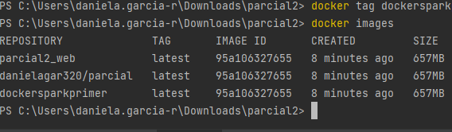

## PARCIAL PRACTICO AREP CORTE 2

### Autor: Daniela García Romero

### Funcionamiento local


### Docker

* Se costrute la imagen en Docker con el siguiente comando:

```

docker build --tag dockersparkprimer .

```


* Podemos revisar que la imagen fue creada

```

docker images

```


* Cree una instancia a partir de la imagen ya creada con el puerto 6000 enlazado

```

docker run -d -p 4567:6000 --name firstdockercontainer dockersparkprimer

```

Podemos ver que esta corriendo


* Se crea el repositorio en docker hub
* 


* Se crea una referencia al repositorio

```

docker tag dockersparkprimer danielagar320/firstsprkwebapprepo

```



* Nos autenticamos y luego hacemos push al repositorio 


```

docker push danielagar320/parcial:latest

```

* Verificamos que se haya subido 


* Instalamos docker en la instancia de aws


* Se adiciona el puerto


